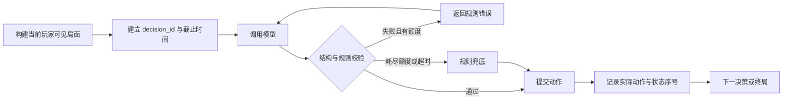

# Doudizhu-Arena：简历深挖与评测闭环设计

审阅日期：2026-09-21。代码基线：`3bb8d2b`（2026-08-09，`feat: add LLM reliability evaluation foundation`）。本次审阅时项目工作区干净。

本材料用于交给另一个 session 制定实施计划并继续开发；本次只审阅代码和编写设计材料。文中的指标目标、实验规模、工时均为建议，**不是已经取得的效果**。

## 1. 判断：值得继续做，而且已经具备 Agent 核心流程

建议项目主题为：**可复现的 LLM Agent 可靠性评测与实时交互平台**。

当前代码已实现“观察局面 → 模型决策 → 规则校验 → 错误反馈与重试 → 执行动作 → 后续回合 → 复盘”的主要链路。这已经是受限环境中的 Agent；不需要先接入 LangGraph、MCP 或更多模型角色，才能称为 Agent 项目。

它最有价值的面试问题是：**如何让一个持续决策的模型完成长流程任务，并且证明它做得可靠、成本可控、用户看到的状态正确？** 斗地主提供清晰规则、动作反馈、长期结果和可控制的初始条件，很适合研究这些问题。牌力是可选研究方向，不必把项目主目标定成“击败专业斗地主 AI”。

对网易有道这份 JD，项目同时可以展示 Vue 实时应用、Python 后端、异步任务、Agent 行为约束与评测。JD 首先要求至少一种端侧技术长板，因此“多观战一致性、断线恢复、可追溯回放”值得成为项目主线之一。与 Research RAG Agent 可以形成互补：前者讲检索、证据与研究任务，Doudizhu 讲实时状态、长期决策和评测工程。

目前可以作为实现型项目写入简历，但**还不足以依据本次证据写成“效果已验证的评测平台”**。差距主要是计量正确性、完整报告和真实运行证据，而不是功能数量。

## 2. 现有能力与证据边界

| 能力 | 当前代码证据 | 可以讲到的程度 |
| --- | --- | --- |
| 多牌手、双桌同牌比赛 | [match.py](/C:/Users/User/c/learning/就业/Doudizhu-Arena/src/backend/arena/tournament/match.py:313) 将同一个发牌结果传给 A/B 桌，并行运行；座位由 `seating.py` 分配 | 可以讲赛制、异步调度和如何控制发牌差异；不是已经测出的性能提升 |
| 受限观察与动作反馈 | [table.py](/C:/Users/User/c/learning/就业/Doudizhu-Arena/src/backend/arena/tournament/table.py:694) 构造己方手牌及公开历史；[llm_agent.py](/C:/Users/User/c/learning/就业/Doudizhu-Arena/src/backend/arena/agent/llm_agent.py:192) 进行解析、反馈和重试 | 可以讲 Agent 观察、动作和反馈边界；需要补严谨的终态计量 |
| 实验规格与冻结输入基础 | [spec.py](/C:/Users/User/c/learning/就业/Doudizhu-Arena/src/backend/arena/evaluation/spec.py:45) 定义 variant、模型、seed、哈希等 | 可复现基础已存在；实际运行时配置还没有完全冻结 |
| 调用与决策观测 | [logging.py](/C:/Users/User/c/learning/就业/Doudizhu-Arena/src/backend/arena/llm/logging.py:53) 记录调用关联、模型信息、usage 和 latency | 有数据采集结构；不代表完整性已被审计，也不代表已经有真实结果 |
| 训练与评测分离 | [memory_training.py](/C:/Users/User/c/learning/就业/Doudizhu-Arena/src/backend/arena/evaluation/memory_training.py:41) 校验种子不重叠，支持训练 checkpoint 和冻结记忆制品 | 可以保留；本轮不把记忆扩展作为主要投入 |
| Web 观战、回放、评测进度 | [ws.py](/C:/Users/User/c/learning/就业/Doudizhu-Arena/src/backend/arena/api/ws.py:197)、[EvaluationDetail.vue](/C:/Users/User/c/learning/就业/Doudizhu-Arena/src/frontend/src/views/EvaluationDetail.vue:6) | 有完整应用雏形；评测详情主要是任务状态和进度，缺指标下钻与失败分析 |

本次为静态审阅，没有启动服务或调用真实模型，没有重新验证历史测试成绩。当前 Windows 中未找到可用的 `conda` 命令，前端没有安装 `node_modules`。仓库 [AGENTS.md](/C:/Users/User/c/learning/就业/Doudizhu-Arena/AGENTS.md:27) 要求项目 Python 脚本使用 `doudizhu-arena` conda 环境，因此本次没有换用其他 Python 执行项目测试。

仓库已有 [可靠性评测计划](/C:/Users/User/c/learning/就业/Doudizhu-Arena/.codex/plans/llm-agent-reliability-evaluation-plan.md:84)，应在它的基础上继续。其“14 项测试通过、当时评测数据库记录为 0”等属于 2026-08-09 的历史记录，本次没有重新查证运行数据库，不能把它们写成当前运行结论。

## 3. 优先补哪些问题

以下 P0 表示“阻塞可信演示或可信结果”，不表示生产事故等级。应先完成 P0，再开始正式效果评测。

| 优先级 | 静态发现与具体位置 | 对项目结论的影响 | 建议修正 |
| --- | --- | --- | --- |
| P0 | [event_bus.py:29](/C:/Users/User/c/learning/就业/Doudizhu-Arena/src/backend/arena/api/event_bus.py:29) 每场比赛只有一个队列；每个 WebSocket 的 [relay:277](/C:/Users/User/c/learning/就业/Doudizhu-Arena/src/backend/arena/api/ws.py:277) 都从该队列 `get()`，消费后再按订阅过滤 | 多个观众会竞争事件；事件可能只到其中一个连接。代码结构明确，尚未运行复现 | 比赛只保留一个分发者，每个订阅者独立队列；增加事件序号、快照恢复和慢客户端处理 |
| P0 | `LLMAgent` 最终失败会返回 `0` 或 `[]`；[table.py:323](/C:/Users/User/c/learning/就业/Doudizhu-Arena/src/backend/arena/tournament/table.py:323)、[table.py:522](/C:/Users/User/c/learning/就业/Doudizhu-Arena/src/backend/arena/tournament/table.py:522) 将正常返回都记为 `success=True` | 模型失败被兜底掩盖；Agent 与 TimeoutManager 各自维护的失败计数可能不一致，影响托管触发和统计 | 使用显式决策结果，区分模型成功、重试成功、兜底和托管；失败计数使用同一语义 |
| P0 | [table.py:838](/C:/Users/User/c/learning/就业/Doudizhu-Arena/src/backend/arena/tournament/table.py:838) 为桌级 resolution 新建 `decision_id`，并固定写 `final_action="pass"`；[timeout.py:148](/C:/Users/User/c/learning/就业/Doudizhu-Arena/src/backend/arena/engine/timeout.py:148) 的领出托管实际会出一张牌 | 同一次决策的模型调用与最终处理断链；记录的动作可能不同于真实执行动作 | 决策开始时分配 ID，所有 attempt 和 resolution 沿用；最终动作由引擎提交结果生成 |
| P0 | [parser.py:181](/C:/Users/User/c/learning/就业/Doudizhu-Arena/src/backend/arena/agent/parser.py:181) 直接接受 pass；[state.py:309](/C:/Users/User/c/learning/就业/Doudizhu-Arena/src/backend/arena/engine/state.py:309) 没有在空桌领出时拒绝空动作；桌级校验还会把非法动作静默改成空列表 | 如果采用领出必须出牌的规则，非法动作会被当成合法，可能反复空过、不能推进牌局 | 先确认当前自定义赛制规则；若领出必须出牌，解析器与引擎同时校验，并让超时兜底在领出时选择合法非空动作 |
| P0 | [runner.py:91](/C:/Users/User/c/learning/就业/Doudizhu-Arena/src/backend/arena/evaluation/runner.py:91) 仍读取当前数据库的系统提示词及可选 base URL；提示词哈希主要来自模板文件 | 同一个 manifest 可能运行不同实际提示词或端点，实验比较不稳定 | 计划阶段解析并冻结实际非秘密配置；执行阶段只允许动态解析凭据 |
| P0 | [models.py:260](/C:/Users/User/c/learning/就业/Doudizhu-Arena/src/backend/arena/db/models.py:260) 对 manifest hash 设唯一约束；[insert_evaluation_run:1349](/C:/Users/User/c/learning/就业/Doudizhu-Arena/src/backend/arena/db/models.py:1349) 复用已有 run | 无法用相同条件创建一次独立重复实验；“重新运行”容易复用旧任务 | 分离条件哈希、独立 run ID、逻辑 task ID 和执行 attempt ID |
| P0 | 预算和价格版本目前仅在 spec 出现；[runner.py:63](/C:/Users/User/c/learning/就业/Doudizhu-Arena/src/backend/arena/evaluation/runner.py:63) 将 `_run_task` 正常返回直接视为完成，未根据比赛实际结果做完整验收 | 成本上限和完成率都可能不符合用户理解 | 增加预检、并发调用费用预留、运行中停止发起新调用、终局审计与部分报告 |
| P1 | [runner.py:58](/C:/Users/User/c/learning/就业/Doudizhu-Arena/src/backend/arena/evaluation/runner.py:58) 只在 task 之间检查取消；[routes/evaluation.py:106](/C:/Users/User/c/learning/就业/Doudizhu-Arena/src/backend/arena/api/routes/evaluation.py:106) 遇到持久化 `running` 状态直接返回 | 当前整场比赛不一定及时取消；进程退出后可能留下无法正常恢复的 `running`；重复 start 还需验证竞态 | 明确取消期限与恢复粒度；事务抢占任务、心跳或租约识别遗留运行；保存执行尝试，不覆盖失败历史 |
| P1 | [useReplayState.js:107](/C:/Users/User/c/learning/就业/Doudizhu-Arena/src/frontend/src/composables/useReplayState.js:107) 主要按时间戳排序，而出牌记录已有 seq；调用日志写库失败可被吞掉 | 同毫秒事件顺序缺少明确保证；报告可能在缺数据时仍展示看似完整结果 | 回放采用权威顺序；报告先执行完整性审计，对缺失关联和日志显示显式状态 |

对于领出 pass，不要直接把项目改成标准三人斗地主。当前是自定义四座位、三人实际出牌及双桌赛制，应把变体规则写入 `rules_version`，先检查现有规则文档和测试，保留其他玩法。

对于暂停/恢复，现有 [pause.py](/C:/Users/User/c/learning/就业/Doudizhu-Arena/src/backend/arena/engine/pause.py:1) 已说明硬崩溃会丢失内存状态；训练 checkpoint 也不等于任意出牌时刻的恢复。可以先完成“未完成 task 重跑”，界面明确写出粒度，不必第一版就做局内任意位置续跑。

## 4. 最值得交付的三个完整流程

### 流程 A：可解释、可计量的 Agent 决策



关键交付是让每次决策都有完整故事：模型第一次输出了什么，为什么无效，重试了几次，最终由谁做出动作，花费多少时间和 token，比赛实际执行了什么。模型超时、provider 出错和规则不合法应有不同记录。

建议契约如下；这是语义约束，可适配现有表结构，不要求全部重写。

| 对象 | 最少字段与约束 |
| --- | --- |
| Decision | `decision_id, run_id, task_attempt_id, match_id, table_hand_id, seat, phase, observation_hash, started_at, deadline`；ID 在任何调用前创建；叫分、出牌与复盘分别标明 phase |
| ModelAttempt | `decision_id, attempt_index, call_id, provider_status, raw_output_ref, validation_status, error_code, latency, usage`；一次语义重试一条；网络重试另记 `transport_attempt` |
| Resolution | 每个已结束 decision 恰好一个：`model_first / model_retry / system_fallback / system_autoplay / cancelled / failed_no_action`；另记触发原因、提议动作和实际提交动作 |
| CommittedAction | `event_id, stream_id, seq, decision_id, actual_action, state_hash_after, rules_version`；与引擎实际状态变更绑定，不从 prompt 或固定字符串推断 |
| BudgetLedger | 调用前预留、调用后结算；关联 `call_id`；未知 usage 不记为零；所有重试、复盘、训练调用分别计入预算 |

实现时要处理“已经提交动作，但日志落盘失败”的情况：至少让动作和决策终态的持久化拥有一致的事务边界；调用明细若缺失，run 标为数据不完整。不要因为日志容错而静默输出完整评测结论。

### 流程 B：从实验配置到失败修复再评测

操作者选取冻结规格 → 预检模型、费用、输入 → 创建独立 run → 执行并观察 → 生成报告 → 点开失败决策与回放 → 做一次有解释的修复 → 在冻结条件下重跑 → 比较效果和代价。

最小报告制品建议沿用旧计划的结构：

```text
run-<id>/
  manifest.json              实际运行输入与规则、代码、模型版本
  integrity.json             数据关联、任务终态、两桌结果的审计
  summary.json               机器可读汇总及指标定义版本
  metrics.csv                variant × phase 指标
  seed_level.csv             独立种子簇的配对统计输入
  report.md                  结论、代价、样本量、不确定性和限制
  failure-cases/              失败快照、原始响应、反馈、动作与复现说明
```

无需先扩出很多页面。优先复用评测详情和现有回放，补三种信息：结果表、失败筛选、单次决策展开。报告必须能离线导出，让面试官不持有 API key 也能查看证据。

### 流程 C：多人观看、断线恢复、可靠回放

建议先采用单进程的最小实现：比赛事件生产者 → 唯一 dispatcher → 各订阅者独立队列 → WebSocket → 前端 reducer。无需为校招项目立即引入 Kafka 或分布式集群。

1. 为影响状态的事件定义明确的 `stream_id + seq`；一种简单选择是每桌独立 stream，比赛级事件独立 stream。不同桌的 seq 不做直接比较。
2. 新连接获取带 watermark 的快照；订阅和快照之间的竞态用先订阅后缓冲、再补齐 watermark 后事件，或等价的原子协议处理。
3. 客户端记录 `last_seq`，忽略重复事件；发现缺口时补事件或重新取快照，不能凭空继续应用。
4. 慢客户端队列达到上限后，要求该客户端重取快照或断开重连；不能静默丢失关键动作，也不能阻塞比赛和其他观众。
5. 动作回放按权威顺序重建。思考展示等辅助事件通过 `decision_id` 关联，可单独限流；跨桌 UI 不必伪造一个有业务含义的全局出牌顺序。
6. 快照与回放哈希使用规范化字段，排除墙钟时间、临时连接状态等非业务字段；不同可见性视图使用相应的状态投影。

这条流程的验收不是“连接成功”，而是多个观众、断线后的观众和离线回放，在同一个事件位置看到相同的权威业务状态。

## 5. 是否进一步结合 Agent：可做，但只选一个明确增量

**必做：把现有 Agent 的反馈、终止和评测闭合。可选：增加一个受约束的工具使用实验。** 不建议把裁判、发牌器、计分器都改成 LLM，也不建议同时扩成教练、解说、研究员、管理器等多个角色。

最合适的可选增量是“规则工具辅助牌手”：

- 工具只操作当前玩家合法可见的信息，例如 `get_legal_actions(observation_id)`、`validate_action(observation_id, proposal)`；校验结果返回结构化错误，不执行动作。
- 模型可先提出动作，遇到复杂牌型再查询工具；有限次调用后提交最终动作，仍由引擎裁定。
- 一次决策建议最多 2 次工具调用，模型调用次数沿用相同预算；超时和预算沿用流程 A。具体次数在 pilot 后冻结。
- 候选数量、排序、截断方式必须固定并写入规格；不允许工具暴露对手隐藏手牌、未来发牌或另桌内部思考。
- 对照对象是已有的规则反馈方案。比较模型执行成功率、决策总延迟、每决策成本、工具调用率和最终比赛表现。
- 如果模型只能从引擎生成的合法候选中选，合法率提高主要体现工具约束的效果，不能解释成“模型学会了斗地主”或独立推理能力提升。

若主要希望突出产品交互，也可以用“只读实验诊断助手”替代：查询指标、检索决策、打开失败回放并给出有 `decision_id` 依据的解释。它应只读已完成实验，不能自行改 prompt、花费预算重跑或生成没有证据的根因。两个扩展选一个即可，核心交付没有完成前暂不开始。

## 6. 量化标准：先规定分母，再决定写什么提升

叫分和出牌是主评测对象，应分 phase 展示；复盘和总结另列，不能混入动作合法率。计数同时保留“决策数”和“调用数”，避免一次失败加三次重试被当作四个独立任务。

约定：`D` 是已开始的行动决策，包括直接托管；`L` 是其中已发起模型尝试的决策；`R0` 是第一次尝试获得正常 provider 返回的决策，返回空文本也属于需校验的输出；`V0` 是第一次返回通过完整结构与规则校验的决策。Provider 超时/异常属于可用性问题，不能归入非法文本。

| 指标 | 定义 | 用途与限制 |
| --- | --- | --- |
| 首次调用可用率 | `R0 / L` | 分离接口不可用与模型输出错误 |
| 首次输出合法率 | `V0 / R0` | 衡量实际返回的输出；必须同时给出 `R0`，避免排除失败后显得很高 |
| 首次决策成功率 | `V0 / L` | 包含第一次调用的可用性影响；与上一项一起报告 |
| 重试后模型成功率 | 最终由合法模型动作完成的决策数 `/ L` | 只含 model_first、model_retry，不含系统兜底和托管 |
| 非法输出恢复率 | 首次输出非法、后续由模型修正成功的决策数 `/ 首次输出非法的决策数` | 未获得重试额度的样本仍保留，并注明原因；provider 错误恢复另列 |
| 兜底率 / 托管率 | `system_fallback / D`，`system_autoplay / D` | 分开报告；二者不能被当作模型成功 |
| 重试率与尝试次数 | 出现语义重试的决策数 `/ L`；每决策尝试次数分布 | 网络重试另计，报告每决策最大模型调用数 |
| 对局正常完成率 | 正常终局的非流局 table-hand 数 `/ 已开始 table-hand 数` | 流局、超时中断、取消、异常分别列出，分母不删除失败 |
| 计划执行情况 | planned、started、正常终局、流局、取消、失败、未开始的绝对数 | 流局可以是合法终态，但不能伪装成一次完成出牌的对局 |
| 延迟 | provider 单次调用、决策端到端、整场运行各自 P50/P95 | 决策端到端包含反馈、工具、重试、校验与提交；成功与失败分组，超时单列 |
| token 与成本 | 所有尝试及相关复盘的 usage、可计价调用成本求和；同时给每完成非流局 table-hand 成本 | 分别列训练一次性成本与推理成本；失败尝试的费用不能丢掉 |
| 数据覆盖率 | 调用 usage、可计价费用、decision-call 关联的完整记录数 `/ 对应应记录数` | 未知为 NULL，不能填 0；缺失覆盖率会限制结论强度 |
| 竞技表现（辅助） | 固定对手下的胜率、差分分数，按种子与角色配对 | 同策略自对弈不能证明该策略击败另一策略；合法率也不等于牌力 |

所有百分比显示分子、分母。分母为 0 显示 `N/A`。P95 固定算法，例如 nearest-rank，并记录样本数；样本很小时只作描述。未完成调用的超时不能以“无成功返回”为由从延迟报告中悄悄删除。

**绝不能把“引擎兜底后动作 100% 合法”写成“模型准确率 100%”。** 规则正确性、系统可用性、模型能力和竞技策略效果是四个不同维度。

## 7. 最小但可信的实验设计

### 7.1 先修正现有对照组

当前 spec 的三组是：无反馈且不重试、规则反馈且最多重试 3 次、规则反馈加复盘和记忆。这可以比较整套方案，但无法单独证明“规则反馈”带来了提升，因为重试次数也变了。[VariantSpec](/C:/Users/User/c/learning/就业/Doudizhu-Arena/src/backend/arena/evaluation/spec.py:54) 甚至禁止“无规则反馈但允许重试”的组合，需先开放该实验控制项。

建议第一轮只研究一个问题：**在相同最大调用预算下，规则反馈能否提高模型执行成功率，代价是什么？**

| 组别 | 最大模型尝试数 | 失败后的信息 | 其他控制 |
| --- | --- | --- | --- |
| A：单次生成 | 1 | 无重试 | 不启用复盘/记忆 |
| B：有重试、无具体规则反馈 | `1 + k` | 固定通用重试提示，不提供具体错误或正确答案 | 模型、采样参数、初始 prompt、上下文、截止时间与 C 一致 |
| C：规则反馈重试 | `1 + k` | 校验器提供具体结构/规则错误 | 与 B 使用相同重试上限及终止规则 |
| D：工具辅助（可选） | 与 C 相同上限 | 增加受控规则工具 | 工具调用、候选构建及额外 token 均计成本 |

`k` 可先取 2，最终值在 pilot 后冻结；也可保留现有的 3。A→B 主要观察增加尝试机会的效果，B→C 观察具体反馈的增量，C→D 观察工具的增量。相同上限不意味着实际成本相等，报告还要展示质量—成本关系。

复盘/记忆保留为后续单独实验，避免第一轮同时改很多变量。现有 `read_only` 冻结的是长期记忆制品，不代表一场比赛内的短期复盘不会变化；如果研究它，必须定义重置时点、训练/开发/测试种子边界，并报告训练成本。

### 7.2 第一层：固定观察的决策基准

目的：让各组真的面对同一局面，尽量减少策略改变后续状态带来的干扰。

1. 从独立规则策略或预先冻结的合法轨迹中提取观察。可用起始规模是 30 个开发局面、150 个留出局面，按来源比赛/seed 分组切分，不能把同一盘相邻动作分别放到开发和测试集。
2. 覆盖叫分、领出、跟牌、应当 pass、炸弹/火箭、复杂牌型、接近终局等情况；分类样本数写入报告。规模只是起点，不保证统计充分。
3. 每个样本包含规则版本、可见手牌、公开历史、轮到谁、当前牌型、合法性判定信息及来源 ID；不包含对手手牌、未来动作或从未来总结出来的记忆。
4. 合法性由确定性规则判定，不需要拿另一个 LLM 当裁判。先用人工审阅的小型规则金集和关键边界测试校验判定器，避免实现错误同时污染生成器和评测器。
5. A/B/C 在相同观察上运行，冻结非处理变量；组别执行次序交错，避免服务商时段变化与组别完全重合。temperature=0 和请求 seed 只能控制部分随机性，不保证云端模型绝对复现。
6. 开发集用于 prompt 调整与故障修复；留出集按预定方案评测。若根据测试集反复修改 prompt，要标记它已成为开发数据，并另留新的确认集。
7. 主报告自然产生的模型错误；另建注入 JSON 错误、超时、429、日志失败的工程测试集。两者不能混在一起计算真实模型非法率。

### 7.3 第二层：闭环对局评测

目的：检查长流程中的失败累积、兜底、资源消耗和完整终局。固定发牌与座位减少初始差异，但各策略会走出不同后续局面，因此闭环结果与固定观察结果要分开解释。

- 先完成一个无需真实模型的完整 mock E2E，贯穿比赛、决策、数据库、报告；不能只 monkeypatch `_run_task` 后证明任务状态变成 finished。
- 随后做 1 个小 seed 的真实连通性验证，确认 usage、模型标识、错误与成本字段的真实行为。
- pilot 可从 `2 seeds × 每场 4 hands × 2 variants × 2 tables = 32 table-hands` 开始。这个量只用于排查执行链和估算成本，不用于有力的优劣结论。
- 用 pilot 的调用数、token、失败率和方差决定正式规模；优先增加独立 seeds，而不是只在两三个 seed 上增加很多相关动作。正式样本数、预算与停止条件在运行前写入 spec。
- 当前示例的 `100 seeds × 20 hands × 3 variants × 2 tables` 是 12,000 个 table-hands 的计划量，不是 300 次模型调用；不要直接启动整个矩阵。
- 若只研究可靠性，可以沿用同策略自对弈；若要声称牌力提高，则增加固定对手阵容，并对角色、队伍和座位镜像轮换。当前 runner 给八个牌手装同一模型和 variant，不能产生目标策略对另一个策略的胜率结论。
- 一个 logical task 的首次失败、后续重跑都保留。质量报告可约定分析哪个完整重复 run，系统可靠性和费用报告必须保留全部启动尝试，不能只挑重跑成功的结果。

### 7.4 不确定性与可复现边界

决策来自同一手、同一比赛或连续复盘时并非独立样本。汇总合法率可以按动作计算，但比较组别时应按来源比赛/seed 成簇做配对分析，例如 seed 级 paired cluster bootstrap。A/B 桌同牌，亦不能当作两份完全独立的发牌样本。

报告同时给出绝对次数、各组比例、百分点差、置信区间和成本差。独立 seed 很少时，明确只做描述性结论，不能把几千个相关动作当作几千个独立样本以缩小置信区间。旧计划中直接对全部动作使用 Wilson 区间的做法，需要补上相关性限制。

区分两种复现：**动作日志回放应能确定性还原；重新调用真实模型只能固定可控条件并观察波动。** 若服务商只给模型别名，没有实际版本或 fingerprint，照实标记无法确认，不能声称完全固定了底层模型。

## 8. 工程验收与停止条件

以下均为拟定验收标准。确定性的正确性测试应全部通过；模型效果不预设“必须提升 20%”之类结论。

| 领域 | 必须达到的验收 | 最少验证场景 |
| --- | --- | --- |
| 规则与终态 | 每个已提交动作满足当前规则；每个已结束 decision 恰好一个 resolution；日志实际动作与引擎一致 | 非法 JSON、缺字段、不在手中的牌、非法牌型、压不过、领出 pass、合法 pass、超时领出兜底 |
| 模型与系统归因 | 模型失败不会记为 model success；连续失败阈值按设计触发；兜底不会抹去原始失败 | 首次失败后恢复、全部失败、provider 异常、直接托管、桌级兜底 |
| 冻结输入与重复运行 | 相同规格可创建两个不同 run；同 run 重复 start 不重复执行；运行后编辑配置不改变该 run | 双 start、配置变更、相同 manifest 重新实验、失败任务重试 |
| 数据完整性 | 测试集关键关联 100% 完整；真实 run 无终态冲突、孤立动作或无法解释的缺失；不完整报告显式标记 | 日志写库失败、重复事件、任务返回但比赛未完成、只有一桌结束 |
| 多人观战 | 2–5 个客户端在相同 watermark 的业务状态一致；相同订阅收到同一关键事件集合 | 同时观看、不同桌订阅、慢客户端、断开重连、重复/乱序/缺口注入 |
| 回放 | 完整动作回放的规范化状态哈希与保存的终态相同 | 同毫秒事件、pass/轮次切换、流局、完整双桌比赛 |
| 取消与恢复 | 取消后停止调度新的模型调用；在已声明的调用 deadline 后进入明确终态；进程退出后可识别并处理遗留 running | 运行中取消、调用中取消、进程重启、失败 task 重跑；不宣称已具备任意局内恢复 |
| 成本控制 | 无价格/无预算的真实运行预检失败；同一 run 的并发调用先原子预留额度；超额不发新调用 | A/B 同时请求、重试、未知 usage、超时未返回账单、预算耗尽后部分报告 |
| 报告链 | 从 run 可追到任务、决策、调用、动作与失败证据；输出前先审计 | 小型 mock 全链、真实 smoke、空分母、缺 usage、全部失败、正常完成与流局混合 |

成本“硬限制”首先是应用侧的调度约束：在费用估计覆盖真实计费项目的前提下，已结算费用加在途预留不超过预算。供应商实际账单可能晚到，取消请求也不保证停止计费；无法精确计价时保守保留预留并标记未知，不能承诺账单绝对不会超出估计。推理 token、缓存价格等按实际 provider 计费方式建模，不能只套统一 input/output 价格后忽略额外费用。

可选交互性能目标：在记录硬件、浏览器、连接数和网络条件后，先以 5 个本地观众、断线后 2 秒内恢复业务状态、权威事件到 UI 可见延迟 P95 小于 300 ms 作为试验目标。它们**尚未测得**，可以在 pilot 后调整；报告同时记录 WebSocket 后台标签页节流等测试条件，不能把 LLM 等待时间混进纯事件传递延迟。

停止规则：

- 数据完整性、规则不变量、预算控制任一未过，停止扩大真实模型实验，先修正。
- 基础 A/B/C 没有形成可解释结果前，不增加第二个 provider、多 Agent 角色或记忆扩展。
- 工具方案如果只增加成本而没有稳定收益，如实报告并保留基础方案；不反复调测试集直到出现提升。
- 三个流程、一个真实失败修复案例、一份完整结果报告和可演示应用已经完成后，就转向面试讲解与简历改写，不继续堆页面。

## 9. 交付顺序与投入建议

这是粗略工作量分配，适合另一个 session 拆任务，并非工期承诺。以 5 个工作块、约 28–40 小时作为首轮范围；真实实验耗时取决于模型吞吐、费用和失败率。

| 阶段 | 建议投入 | 交付物 | 结束条件 |
| --- | --- | --- | --- |
| 0：复核与建立基线 | 2–3 小时 | 复核本文发现、规则版本、可运行环境、最小演示命令、现有测试结果 | 明确当前规则与现有功能，先留存可复现的问题场景 |
| 1：正确性与观测 | 8–10 小时 | 统一 decision/outcome、领出及兜底规则、关键事件扇出、多客户端回归 | P0 决策计量与观战问题关闭 |
| 2：可复现评测闭环 | 8–12 小时 | 冻结配置、独立 run/attempt、预算、取消/恢复语义、完整性审计、报告 | mock E2E、异常路径与关键口径可验证 |
| 3：真实实验与一例修复 | 6–9 小时加模型运行时间 | 固定观察集、真实 smoke/pilot、冻结正式结果、一个失败案例及前后对比 | 能解释效果、代价、样本限制和修复原因 |
| 4：展示与面试材料 | 4–6 小时 | 评测详情下钻、可靠回放、3–5 分钟演示、两条有证据的简历描述 | 面试官可以从结果追到具体代码、失败轨迹和实验条件 |

时间不足时，优先交付“观战一致性修复 + 决策正确归因 + A/B/C 小型完整报告 + 一个失败案例”；正式样本不足就写清楚探索性规模。工具辅助属于后续加分项，不应挤掉这些核心交付。修复分支与报告应保留版本对应关系，比较规则反馈的实验不能同时更换规则引擎，否则无法归因。

## 10. 怎样达到简历能深挖的标准

可以用六项自检：

1. **讲得清对象与约束。** 为什么选择这个赛制、哪些信息模型可见、什么叫一次成功决策、任务何时终止。
2. **能画出完整链路。** UI 配置 → API → runner → agent/provider → 规则引擎 → 数据库/事件 → 观战与报告。
3. **能解释一个真实故障。** 有复现输入、根因、具体修正、回归证据和修复后的结果。
4. **有可信指标。** 有冻结数据、对照条件、明确分母、实际成本和不确定性，数字能追溯到制品。
5. **有完整可演示产品。** 能配置、运行、观察、重连、查看结果与失败；无 API key 时也能使用冻结回放演示。
6. **能说明个人贡献和取舍。** 哪些功能由你设计、哪些使用 AI 辅助、哪些结论由你验证，以及为什么不扩成更重的系统。

可重点准备四个深挖故事：

| 故事 | 面试官可能追问 | 需要的证据 |
| --- | --- | --- |
| 为什么几个观众看到不同牌局 | Queue 与广播有什么区别？慢观众如何隔离？快照与增量事件之间有无竞态？ | 双客户端复现、分发设计、watermark 协议、状态一致性测试 |
| 为什么完成率很高但模型表现很差 | pass 是模型意图还是兜底？连续失败如何累计？谁是动作的最终事实来源？ | 一次失败决策的全链路、结果枚举、修复前后统计 |
| 为什么重试实验看起来变好了 | 是多调用几次还是规则反馈有效？牌局相关性怎么处理？为什么合法率不代表胜率？ | A/B/C 固定观察结果、闭环结果、配对与成本分析 |
| 为什么相同配置还复现不了 | prompt 是否来自可变数据库？模型别名会不会变？恢复和重跑有什么不同？ | manifest、独立 run/attempt、配置变更测试、回放哈希 |

不要把所有故事都讲成“我加了一个功能”。应按“发现的问题 → 证据 → 方案选择 → 验证 → 局限”展开。AI 可以帮助生成迁移、测试骨架、UI 和报告，但你必须能亲自解释决策终态、事件顺序和实验分母；这些决定项目的可信度。

**当前可用的实现描述（仍需本人核对贡献范围）：**

> 开发基于 Vue 与 Python 异步后端的 LLM 对战平台，支持双桌同牌比赛、结构化动作校验、规则反馈重试及观战回放，并搭建按模型、种子与策略配置的评测框架。

**完成本设计后的效果描述模板，方括号必须替换为真实制品结果：**

> 构建包含 [N] 个独立测试来源、[M] 个固定局面与 [H] 个闭环 table-hands 的评测集；在固定 [模型/版本] 和调用预算下，规则反馈相较通用重试使模型执行成功率从 [a]% 变为 [b]%，决策 P95 为 [t]、平均成本为 [c]，保留原始失败与系统兜底计量。

> 设计独立订阅队列、顺序事件与快照恢复协议，修复多观战连接分流事件问题；在 [硬件/网络]、[n] 并发观众下完成 [k] 次断线/乱序场景验证，回放与权威终态一致，恢复 P95 为 [x]。

如果结果没有提升，可以写“量化了可靠性与成本取舍，并定位、修复若干类失败”，不必强行编造百分比。样本规模与测试通过数可作工程证据，不能替代用户效果或线上规模。

## 11. 可直接交给另一个 session 的任务说明

```text
请基于 Doudizhu-Arena 当前代码，制定并执行“可复现的 LLM Agent 可靠性评测与实时交互平台”补强计划。

项目路径：C:/Users/User/c/learning/就业/Doudizhu-Arena
审阅材料：C:/Users/User/c/learning/就业/项目深挖/Doudizhu-Arena-简历深挖与评测闭环设计-20260921.md
参考已有计划：C:/Users/User/c/learning/就业/Doudizhu-Arena/.codex/plans/llm-agent-reliability-evaluation-plan.md
本文审阅基线是 3bb8d2b。开始前检查实际 HEAD 与工作区差异，阅读适用的 AGENTS.md，使用规定的 doudizhu-arena conda 环境。先复核静态发现，不要把本文当作已运行通过的测试报告。

目标：形成完整 Agent 决策、实验报告和实时观战/回放三个流程，并留下一个可展示的失败修复案例。先复用已有架构与页面，保留自定义双桌赛制；不集成 Mandol，不默认新增 Agent 框架或多角色编排。

请先给出按依赖排序的实施计划、变更边界和验收项，再逐阶段实施：
1. 统一 decision_id、模型 attempt、桌级 resolution 和实际动作；分开模型成功、重试成功、兜底、托管、取消与失败。验证领出 pass 规则、超时兜底和连续失败计数。
2. 修复每个 WebSocket 竞争消费同一 match queue 的问题；实现独立订阅、权威序号、快照 watermark、断线恢复、慢客户端处理与可靠回放。
3. 冻结实际 prompt、端点和参数等非秘密输入；分离 manifest 与独立 run、task attempt；落实预算预留、取消期限、遗留 running 恢复与终局完整性审计。
4. 生成 integrity.json、summary.json、metrics.csv、seed_level.csv、report.md。先打通 mock 完整比赛 E2E，再跑真实 smoke/pilot；完成合法性、可用性、重试、兜底、完成率、延迟与成本的分母定义和边界测试。
5. 第一轮用“单次生成 / 相同预算的通用重试 / 规则反馈重试”研究反馈的增量。固定观察评测与闭环对局分开，按来源比赛/seed 划分开发和测试数据；反思/记忆另作后续实验。
6. 归档一个真实失败：观察、原始输出、错误、反馈、最终动作、代码修正及前后证据。复用现有评测详情与回放完成演示。

规则工具辅助牌手仅为可选后续项；核心闭环完成后再判断是否需要。不要预先承诺模型提升百分比，不要将系统兜底后的合法动作算作模型成功，不要把同策略自对弈当成策略间竞技优势。

真实模型实验要先确定实际模型、价格和明确预算，保留项目已有的真实调用确认机制。示例 YAML 的 100 美元不是本次授权，禁止直接启动 100 seeds × 20 hands × 3 variants 的默认矩阵。可以先完成所有本地实现和 mock 验收，将具体可审阅的运行规格作为真实实验的启动依据。

最终交付：代码和适当测试、环境与启动步骤、冻结实验输入和结果、一个失败修复案例、可重复演示脚本、按真实个人贡献整理的简历描述。说明所有未完成项和未验证结论。
```

当前最优先的成果，是让一次模型失败、一次观战重连和一次实验比较都有完整、可追溯的解释。完成这些以后，这个项目就具备可靠性、实时应用与评测设计三个可以持续深挖的方向。
